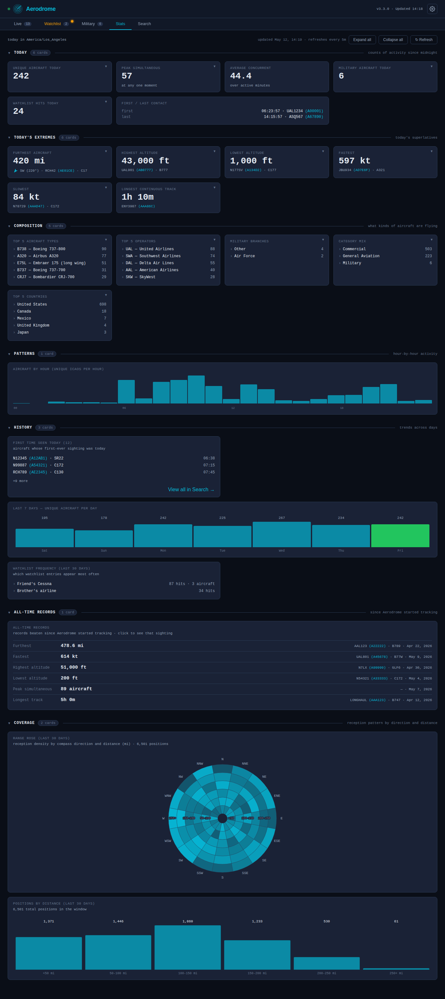
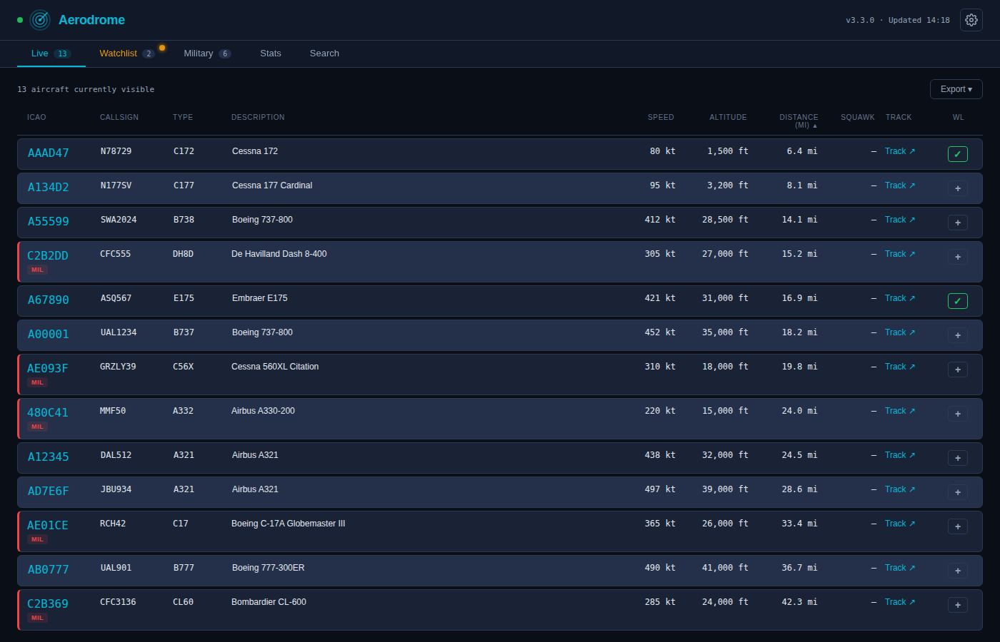
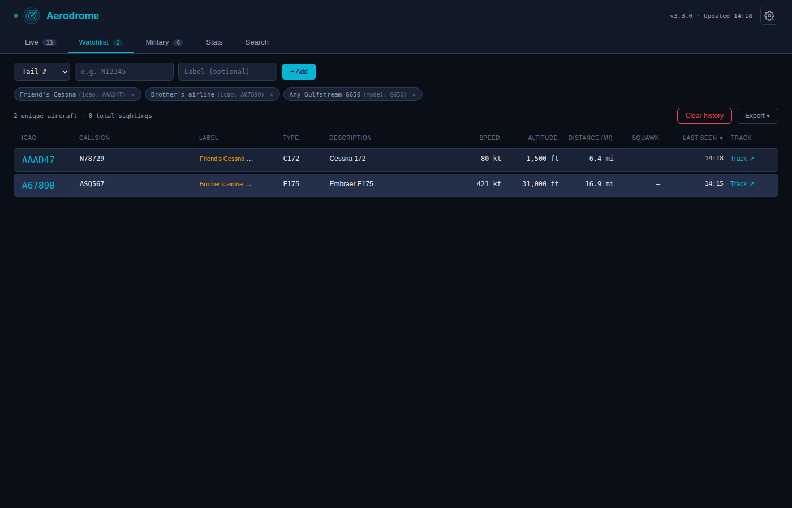
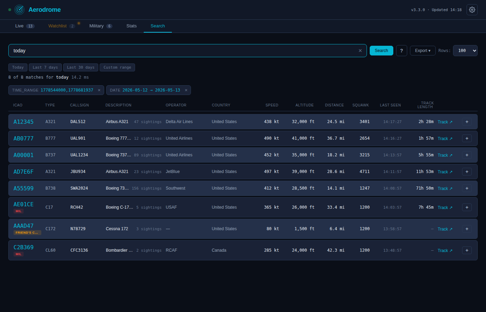

# Aerodrome
<!-- Version: 3.3.0 -->

[](https://opensource.org/licenses/MIT)
[](https://www.python.org/downloads/)
[](https://ubuntu.com/)

Aerodrome turns your home ADS-B receiver into a dashboard you'd actually
leave open. It's not a replacement for FlightAware — it shows you _your_
sky, indexed and searchable, without the cloud account or the ads.



## What it is

Aerodrome is a self-hosted web dashboard for your personal ADS-B receiver.
Point it at readsb, dump1090, tar1090, or anything that exposes a JSON
aircraft feed, and it turns the raw stream into something worth leaving
open on a second monitor: live aircraft, a personal watchlist,
auto-detected military traffic, full-text search across every aircraft
your receiver has ever seen, a rich Stats tab, and optional push
notifications to your phone.

It's open-source under MIT, runs on anything from a Raspberry Pi to a
spare x86 box, stays entirely on your LAN unless you choose otherwise,
and has no cloud dependencies beyond an optional registration-lookup API.

## What it isn't

It's not a global tracker. The big commercial sites pool data from
thousands of receivers worldwide; Aerodrome only shows what your antenna
hears. That's deliberate — your sky, indexed the way you care about it,
without an account or a subscription.

It's also not a polished product. Aerodrome started as a bash script that
pinged my phone when a military aircraft flew over, and grew from there.
Every feature exists because someone — usually me, sometimes a user
running on a Pi near a busy airport — hit a specific frustration and
wanted a fix. The throughline is "build the tool you want to use
yourself, not the product you'd pitch."

## The five tabs



**Live.** What's in the sky right now, refreshed every few seconds.
ICAO, callsign, type, altitude, speed, distance. Military aircraft are
highlighted; watchlist entries are tagged. Click any aircraft for an
expanded detail view with a tracking link to an external map.



**Watchlist.** Aircraft you've flagged to follow. Add by ICAO, callsign
prefix, or a substring match on aircraft type (so "cirrus" catches every
Cirrus). Tabs badge when there's a watchlist aircraft currently in the
air, optionally with a configurable flash effect.

**Military.** Auto-detected military flights based on hex-range rules,
callsign prefixes (RCH, NAVY, ARMY...), and special-aircraft lists.
Special categories (AWACS, refueling, VIP transport, etc.) get their own
labels where applicable.

**Stats.** Today's counts, all-time records, aircraft-type breakdown,
hourly activity histogram, "first time seen" list, 7-day unique-aircraft
chart, watchlist frequency, and a polar coverage rose showing which
compass directions your antenna pulls best. Most cards drill down — click
any extreme value or list row to see the specific aircraft behind it.



**Search.** Full-text search across every aircraft your receiver has
ever seen, going back as far as your retention window allows. Type a
callsign, ICAO, type, country, or operator. Use parser tokens like
`today`, `last:7d`, `hour:14`, `distance:50-100`, `military`,
`watchlist`, `commercial`, `helicopter`. Sortable columns, date-range
presets, page-size control, CSV export, and shareable hash URLs.

## Architecture

```
┌─────────────────┐       ┌─────────────────────┐       ┌──────────────┐
│  ADS-B Receiver │──────▶│  Aerodrome host     │◀──────│  Browser     │
│  (readsb, etc.) │ HTTP  │  (Python + SQLite)  │ HTTP  │  (laptop or  │
│  serves JSON    │       │                     │       │   phone)     │
└─────────────────┘       └─────────────────────┘       └──────────────┘
```

Three moving parts in one Python process:

- **Collector** — polls your receiver every 60 seconds, classifies each
  aircraft, enriches with registration lookup via hexdb.io, appends rows
  to SQLite (WAL mode, so reads and writes don't contend).
- **Web server** — FastAPI + Uvicorn, serves the dashboard and ~80 JSON
  API endpoints. Single-process, bound by default to your LAN IP.
- **Notifier** — optional. Push notifications via [ntfy](https://ntfy.sh)
  (self-hosted or the public relay) with cooldowns and rate limits so a
  busy hour doesn't spam your phone.

## Project structure

```
aerodrome/
├── main.py                       entrypoint — wires up collector + web + notifier
├── collector.py                  ADS-B polling, classification, hexdb enrichment, SQLite writes
├── server.py                     FastAPI app — dashboard routes + ~80 JSON endpoints
├── notifier.py                   ntfy push notifications with cooldowns
├── search.py                     Search-tab query language and ranking
├── schema_migrations.py          forward-only DB migrations, runs on startup
├── config_validator.py           startup validation of config.yaml
├── capacity.py                   disk and growth projection helpers
├── distance.py                   haversine + unit conversion
├── categorize.py                 military / watchlist / civil classification
├── countries.py                  ICAO range → country lookup
├── designators.py                aircraft type and operator decoders
├── hexdb_resolver.py             registration lookup (hexdb.io client)
├── slow_query_log.py             query-timing instrumentation
├── ntfy_installer.py             interactive ntfy onboarding helper
├── config.yaml.example           shipped template for config.yaml
├── requirements.txt              runtime dependencies (pinned compatible-with)
├── requirements-dev.txt          screenshot harness + PDF builder deps
├── install.sh                    setup script (venv, systemd unit, sudoers rule)
├── uninstall.sh                  symmetric removal
├── bump-version.sh               release tooling — version + CHANGELOG + PDF rebuild
├── VERSION                       single line, the canonical version string
├── templates/                    HTML pages served by server.py
├── static/                       CSS, JS, fonts, theme assets
├── scripts/
│   ├── bootstrap.sh              curl-installable one-line setup (see Install)
│   ├── package-release.sh        produces release zip + .sha256
│   ├── build_overview_pdf.py     rebuilds docs/Aerodrome_Overview.pdf
│   ├── screenshots.py            Playwright harness for docs/*.png
│   └── check_docs.py             advisory drift detector
├── tools/
│   └── synthetic_feeder/         demo-mode synthetic ADS-B feeder (v3.1.0)
│       ├── generator.py          fleet simulation — deterministic ICAOs, motion model
│       ├── serve.py              HTTP server — serves /data/aircraft.json
│       ├── seed_watchlist.py     install-time demo-watchlist seeder
│       └── backfill.py           generate historical sightings for testing
├── docs/                         user-facing documentation, screenshots, PDF
├── .github/                      issue templates, PR template, repo-setup guide
├── test_categorize.py            unit tests — military/civil classification
├── test_designators.py           unit tests — aircraft type and operator decoders
├── test_migration_v7.py          unit tests — schema migration v7
├── test_preflight.py             unit tests — startup config validation
├── test_schema_migrations.py     unit tests — migration framework
├── test_search.py                unit tests — search query language
├── test_search_v2_91_tokens.py   unit tests — search token grammar (v2.91 additions)
├── test_session_track.py         unit tests — session-aware track stitching
├── README.md                     this file
├── CHANGELOG.md                  per-release entries, bottom-up additions
├── CONTRIBUTING.md               bug-report checklist, why PRs are disabled
├── SECURITY.md                   vulnerability reporting and threat model
├── ARCHITECTURE.md               deeper architectural notes for forkers
├── DEVELOPMENT.md                local-development setup and testing
├── API.md                        endpoint reference
└── LICENSE                       MIT
```

## Install

You need:

- An ADS-B receiver on your network serving an `aircraft.json` endpoint
  (readsb, dump1090-fa, tar1090, PiAware — anything compatible)
- A Linux host with systemd and one of: apt-get (Debian/Ubuntu/Raspberry Pi OS),
  dnf (Fedora/RHEL/Rocky/Alma), pacman (Arch/Manjaro), or zypper (openSUSE).
  All four families are tier-1 supported as of v3.2.0.
- Python 3.10+ (installed automatically by the bootstrap if missing)

Don't have a receiver yet but want to see what Aerodrome looks like
populated? Pass `--demo` to the bootstrap and it installs a small
synthetic feeder alongside Aerodrome itself, so the dashboard comes
alive with 50 simulated aircraft, watchlist hits, and the occasional
emergency squawk. When you're ready for the real thing, an in-app
wizard at **Configuration → Demo → Switch to real receiver** walks
through the transition. See the
[Demo mode](docs/INSTALL.md#demo-mode-v310) section in INSTALL.md for
details.

One command:

```bash
bash <(curl -fsSL https://install.aerodromeadsb.com)
```

The bootstrap detects your platform, installs prerequisites (`unzip`,
`python3-venv`), downloads the latest release zip from GitHub Releases,
verifies its SHA256 checksum, prompts for the bare minimum config
(receiver IP/port, lat/lon, distance unit), and hands off to the
bundled `install.sh` to create a Python venv, install the systemd
service, and start it. The whole thing typically takes under a minute.
When it finishes, open `http://your-host:8000/` in a browser and visit
**gear menu → Configuration** to adjust the timezone, set up a
watchlist, enable push notifications, and configure the rest — no
terminal or YAML editing required.

After the initial install, future releases install with one click from
the `/updates` page in the dashboard — also no terminal or zip-handling
required.

<details>
<summary>Manual install (alternative)</summary>

If you'd rather inspect the bootstrap before running it, install
offline, or pin to a specific release version:

```bash
# Download a release zip from
#   https://github.com/preston-peterson/aerodrome/releases
# (or git clone the repo)

unzip aerodrome-v*.zip
cd aerodrome-v*/

# Edit config.yaml — set receiver.ip to your ADS-B receiver's address;
# set receiver.lat / receiver.lon if you want the Distance column populated.
$EDITOR config.yaml

# Install. Creates a Python venv, sets up the systemd service, and starts it.
chmod +x install.sh
./install.sh
```

The bootstrap script itself is at `scripts/bootstrap.sh` in the zip;
you can also run it directly from a local copy with `--from-zip <path>`
to install from a zip you've already downloaded:

```bash
bash scripts/bootstrap.sh --from-zip ~/Downloads/aerodrome-v3.0.15.zip
```

Run with `--help` for the full list of flags (receiver settings,
prefix path, version pin, non-interactive mode, etc.).

</details>

For more — updating, configuring, troubleshooting, hardware sizing,
remote access — see **[docs/INSTALL.md](docs/INSTALL.md)**.

## Hardware sizing, briefly

ADS-B traffic varies a lot by location. Three rough tiers:

- **Rural / quiet airspace** (under ~500 aircraft/day): Raspberry Pi 4
  with any reasonable SD card. Everything is fast.
- **Suburban / moderate** (~500-2,000 aircraft/day): Raspberry Pi 4 still
  works, but use an A2-rated SD card for random-I/O performance.
- **Major-airport / heavy** (2,000+ aircraft/day): Raspberry Pi 5 with an
  NVMe HAT, or any small x86 box with an SSD. Storage I/O bottlenecks
  Stats-tab queries on busy receivers; NVMe is roughly 10-20× the
  random-read throughput of an SD card.

Aerodrome ships a built-in `/performance` page that measures your actual
system — DB size, query timings, disk throughput — and prints
auto-generated hints. Measurement first; no guessing.

Fuller guidance and concrete examples in
**[docs/INSTALL.md](docs/INSTALL.md)**.

## Some things Aerodrome does not have

No cloud account. No user tracking. No telemetry. No ads. No subscription.
No analytics SDK. No "premium features." No agreement to sign. It runs
on your hardware, serves your data, and talks to exactly the services
you tell it to.

## Project status

Aerodrome is a one-person project I work on for fun. The code is here
because it might be useful to someone else with a home ADS-B receiver
and similar tastes — not because I'm building a product or a community.

What that means in practice:

- **Bug reports are welcome.** File an issue if something is broken;
  I'll usually get to it eventually. Best-effort, no SLA, no promises.
- **Pull requests are disabled at the repository level.** Aerodrome is
  built the way one person wants it built. If you want to take it
  somewhere different, the MIT license invites you to fork freely —
  that's a feature, not a problem.
- **Feature suggestions** are fine in issues, but the bar for "I'll
  actually build this" is "I want it for myself." If the answer is
  "great idea but not for me," I'll say so.

## Read more

- **[docs/Aerodrome_Overview.pdf](docs/Aerodrome_Overview.pdf)** —
  the longer, narrative version: origin story, design decisions, what's
  interesting about the data, project numbers.
- **[docs/INSTALL.md](docs/INSTALL.md)** — full operations manual:
  install, update, configure, back up, troubleshoot.
- **[CHANGELOG.md](CHANGELOG.md)** — every release, with explanatory
  notes on what changed and why.
- **In-app docs** — once installed, the gear menu's Documentation page
  renders all of these inline so you can read them on a phone without
  leaving the dashboard.

## License

[MIT](LICENSE). Use it, fork it, modify it, redistribute it.

## Acknowledgments

Built on top of the work of many others:

- [readsb](https://github.com/wiedehopf/readsb) /
  [dump1090](https://github.com/flightaware/dump1090) /
  [tar1090](https://github.com/wiedehopf/tar1090) — the ADS-B receivers
  whose JSON output Aerodrome consumes.
- [hexdb.io](https://hexdb.io) — the registration lookup service.
- [ntfy](https://ntfy.sh) by Philipp C. Heckel — the push notification
  service.
- [FastAPI](https://fastapi.tiangolo.com) /
  [Uvicorn](https://www.uvicorn.org) /
  [SQLite](https://www.sqlite.org) — the runtime.
- [Leaflet](https://leafletjs.com) — the JavaScript map library that
  renders the aircraft detail page's position map. Bundled with
  Aerodrome (no CDN dependency at runtime).
- [OpenStreetMap](https://www.openstreetmap.org) contributors — the
  light-theme base map tiles and the underlying map data. Used under
  the [Open Database License](https://www.openstreetmap.org/copyright).
- [CARTO](https://carto.com) — the dark-theme "Dark Matter" base map
  tiles, used under their
  [attribution terms](https://carto.com/attributions). Built on top of
  OpenStreetMap data.
